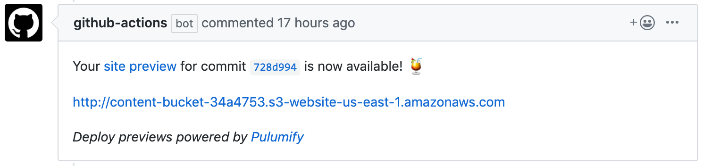

# Pulumify - Easy Static Website Previews for GitHub :tropical_drink:

Pulumify automatically builds and publishes static website previews to AWS S3 in response to GitHub Pull
Requests. This lets you rapidly iterate on website changes that are easily reviewable with your team.

Just configure it using the steps below, open a new PR, and voila!



This action uses [Pulumi](https://pulumi.com) and [GitHub Actions](
https://help.github.com/en/categories/automating-your-workflow-with-github-actions). Pulumi supports other
clouds and based on interest, we'd be happy to add support for Azure, GCP, etc.

## Configuring Pulumify in Your Repo

To enable Pulumify in your repo, do the following:

1) [Enable GitHub Actions in your account](https://github.com/features/actions/signup/).

2) [Configure your GitHub secrets](
   https://help.github.com/en/articles/virtual-environments-for-github-actions#creating-and-using-secrets-encrypted-variables).
   This must include your [`PULUMI_ACCESS_TOKEN`](https://app.pulumi.com/joeduffy/settings/tokens) in addition to your
   cloud credentials. For example, to deploy to AWS, you'll need `AWS_ACCESS_KEY_ID` and `AWS_SECRET_ACCESS_KEY` values
   with appropriate IAM permissions to deploy an S3 website to your account.

3) Commit the following file as `.github/workflows/pulumify.yml`:

    ```
    name: Pulumify
    on: [pull_request, delete]
    jobs:
      updateLivePreview:
        name: Update Live Preview
        runs-on: ubuntu-latest
        steps:
        - uses: docker://joeduffy/pulumify
          env:
            AWS_ACCESS_KEY_ID: ${{ secrets.AWS_ACCESS_KEY_ID }}
            AWS_SECRET_ACCESS_KEY: ${{ secrets.AWS_SECRET_ACCESS_KEY }}
            GITHUB_TOKEN: ${{ secrets.GITHUB_TOKEN }}
            PULUMI_ACCESS_TOKEN: ${{ secrets.PULUMI_ACCESS_TOKEN }}
            PULUMIFY_BUILD: make ensure && hugo --buildFuture -e $GITHUB_SHA
            PULUMIFY_ROOT: public
    ```

   Feel free to customize  the `PULUMIFY_BUILD` or `PULUMIFY_ROOT` settings as appropriate. It's also possible
   to stand up your stacks in a Pulumi organization using `PULUMIFY_ORGANIZATION`.

After these three steps, the Pulumify GitHub Action will comment on your PRs automatically with URLs to your websites.
